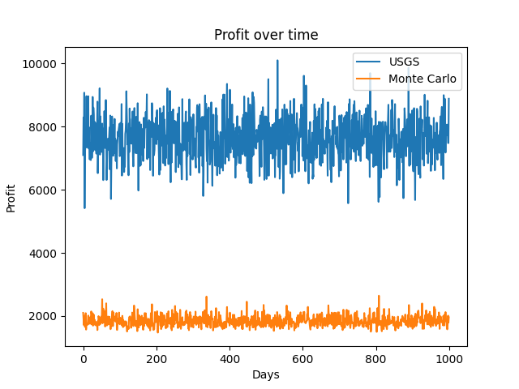

# Route Optimization with Continuous Data Collection of an Uncertain Road System:

The purpose of this project is to create package delivery algorithms that can schedule deliveries while updating information about the road system. The delivery of single large and multiple small packages to retail or average consumers involves significant planning to schedule deliveries and maximize profit. However, this is not an easy task for a delivery company that is new to an area and has no knowledge of the road system. First, the team creates a road map of an area assigning random traversal times between each point and guaranteeing the road system is connected. 

For large single trip packages, the team first creates a updating semi-greedy scheduler (USGS) that prioritizes pay rate for a delivery based on its information. Second, the team develops a way of creating sufficiently random paths to each delivery that allows the scheduler to update its information about the road system. Next, the team creates a Monte Carlo scheduler that utilizes particle swarm optimization to pick the best delivery schedule with no data collection. Finally, the researchers compare the methods to determine the performance of the USGS algorithm.

For multiple small packages, the team solves this problem by implementing the ant colony optimization algorithm to determine a route to deliver all of the packages. The team accomplishes this by having an initial discovery phase of the road map where agents travel to prospective delivery locations. After this phase, a single carrier constructs the optimal delivery route for all of the packages.

## Uncertainty Algorthims Implemented: 

1. Pure Randomness
   - Our Monte Carlo method utilizes particle swarm optimization to determine an optimal delivery schedule for a single day. This is done by using a naive path planner in the form of a breadth first search. The algorithm then randomly delivers packages until the time limit is reached. 100 of these schedules are then created and the delivery schedule with the best profit is used to deliver packages. 
  
2. Explore and Exploit 
   - Our USGS utilizes an Epsilon Greedy algorithm to inject randomness into the actual path the delivery drive takes and subsequently updates its information with. This is done by using a Djikstra's for determining the single source shortest path (SSSP) to all nodes in the graph. The algorithm then reconstructs the path to the source with a random chance of picking any road that it hasn't already traversed. This then forces the driver to explore the road system after each delivery and update its information about road traversal times for the scheduler.
  
3. Sorting and Ordering 
   - Our USGS utilizes a prioritization algorithm prioritizes uses the information it knows about the road map to calculate a pay rate for each delivery. It does this by using the stored road traversal time to calculate a perspective time to deliver a package and the using that scale the pay for delivering the package.
  
4. Scheduling 
   - Our USGS utilizes a predictive priority algorithm (pay rate) to pick an optimal delivery schedule. This is done by calculating the priority (pay rate) after each delivery. Because the information about the road system is updated after each delivery, this guarantees the scheduler is picking deliveries that will yield the most profit before picking the next delivery to make.

## Uncertainty Algorthims attempted:

We were unable to fully implement the Ant Colony algorithm with our node edge interface given the time constraint, however we did get these algorithms working but are unable to visualize them: 

1. Bayes Rule
   - Ant Colony Optimization utilizes a modified Baysian rule to determine the probability of traversing a the edges connected to a node. This is done by using the pheremones on each edge connected to a given node to calculate a posterior for each edge. These posteriors are then used to dictate the probability of the ant using that edge in its path.

2. Scheduling 
   - Our Ant Colony algorithm utilizes a predictive priority algorithm to create a delivery route which optimizes the profit given a list of packages. This is done making the amount of pheremone left each edge a function of the profit for delivering to that node and the time to traverse the edge. This effectively creates the delivery route based on the best profit.

# Monte Carlo Simulation and Updating Semi-Greedy Scheduler (USGS):

## Running Code

To run this code all that needs to be done is run the main.py file

## Outputs

The outputs for this code is listed below:

- Graph showing the profit over time of the USGS and Monte Carlo scheduler for large package delivery
- Interactive GUI that shows how the USGS algorithm updates its belief space over time.

## Results

The following figure shows the graph comparing the profit of the USGS and Monte Carlo Scheduler.

As can be seen, the USGS scheduler greatly outperforms the Monte Carlo scheduler. This is likely because the Monte Carlo scheduler is contrained to only picking paths that use the least amount of edges. The team attempted to make up for this by allowing the Monte Carlo scheduler to access the values of each road, however, the figure above shows it doesn't equate. In addtion, the figure above shows the Epsilon Greedy algorithm converges fairly fast to the average time to traverse each road. This is likely because several deliveries can be made each day meaning the algorithm is updating its information 100's of times a day.
### Ant Colony Algorithm:
